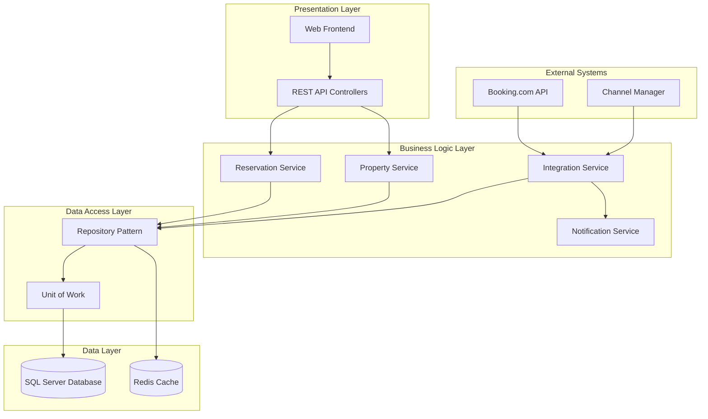

# Design Document

## Overview

The Hotel Reservation Management System is a web-based intranet application built with ASP.NET Core (C#) backend and modern web frontend. The system provides centralized management of hotel reservations, integrating with Booking.com via XML APIs while maintaining a robust SQL Server database for data persistence. The architecture follows a layered approach with clear separation of concerns, ensuring scalability and maintainability.

## Architecture

### High-Level Architecture



### Technology Stack

**Backend:**
- ASP.NET Core 8.0 (C#)
- Entity Framework Core for ORM
- SQL Server 2019+
- Redis for caching
- Hangfire for background jobs
- SignalR for real-time updates

**Frontend:**
- HTML5, CSS3, JavaScript (ES6+)
- Bootstrap 5 for responsive design
- FullCalendar.js for calendar views
- Chart.js for dashboard analytics
- SignalR client for real-time updates

**Integration:**
- HttpClient for XML API calls
- System.Xml for XML parsing
- Polly for retry policies
- Serilog for structured logging

## Components and Interfaces

### Core Services

#### ReservationService
```csharp
public interface IReservationService
{
    Task<ReservationDto> CreateReservationAsync(CreateReservationRequest request);
    Task<ReservationDto> UpdateReservationAsync(int id, UpdateReservationRequest request);
    Task<bool> CancelReservationAsync(int id, string reason);
    Task<IEnumerable<ReservationDto>> GetReservationsByDateRangeAsync(DateTime from, DateTime to, int? hotelId = null);
    Task<bool> CheckAvailabilityAsync(int roomId, DateTime checkIn, DateTime checkOut);
    Task<IEnumerable<ConflictDto>> DetectConflictsAsync(int roomId, DateTime checkIn, DateTime checkOut);
}
```

#### PropertyService
```csharp
public interface IPropertyService
{
    Task<HotelDto> CreateHotelAsync(CreateHotelRequest request);
    Task<HotelDto> UpdateHotelAsync(int id, UpdateHotelRequest request);
    Task<RoomDto> CreateRoomAsync(CreateRoomRequest request);
    Task<RoomDto> UpdateRoomAsync(int id, UpdateRoomRequest request);
    Task<IEnumerable<RoomDto>> GetAvailableRoomsAsync(int hotelId, DateTime checkIn, DateTime checkOut);
    Task<bool> SetRoomStatusAsync(int roomId, RoomStatus status);
}
```

#### BookingIntegrationService
```csharp
public interface IBookingIntegrationService
{
    Task SyncReservationsAsync();
    Task PushAvailabilityUpdateAsync(int roomId, DateTime date, int availableCount);
    Task<BookingReservationDto> FetchReservationAsync(string bookingReference);
    Task HandleWebhookAsync(string xmlPayload);
}
```

### API Controllers

#### ReservationsController
```csharp
[ApiController]
[Route("api/[controller]")]
public class ReservationsController : ControllerBase
{
    [HttpGet]
    public async Task<ActionResult<IEnumerable<ReservationDto>>> GetReservations(
        [FromQuery] DateTime? from, 
        [FromQuery] DateTime? to, 
        [FromQuery] int? hotelId);
    
    [HttpPost]
    public async Task<ActionResult<ReservationDto>> CreateReservation(CreateReservationRequest request);
    
    [HttpPut("{id}")]
    public async Task<ActionResult<ReservationDto>> UpdateReservation(int id, UpdateReservationRequest request);
    
    [HttpDelete("{id}")]
    public async Task<ActionResult> CancelReservation(int id, [FromBody] CancelReservationRequest request);
}
```

### Frontend Components

#### Calendar Component
- Interactive Gantt-style calendar using FullCalendar.js
- Drag-and-drop functionality for reservation management
- Real-time updates via SignalR
- Filtering capabilities by hotel, room type, and date range

#### Dashboard Component
- KPI widgets for occupancy rates and revenue
- Real-time notifications panel
- Check-in/check-out lists for current day
- Chart visualizations for trends

## Data Models

### Core Entities

#### Hotel Entity
```csharp
public class Hotel
{
    public int Id { get; set; }
    public string Name { get; set; }
    public string Address { get; set; }
    public string Phone { get; set; }
    public string Email { get; set; }
    public bool IsActive { get; set; }
    public DateTime CreatedAt { get; set; }
    public DateTime UpdatedAt { get; set; }
    
    // Navigation properties
    public ICollection<Room> Rooms { get; set; }
    public ICollection<Reservation> Reservations { get; set; }
}
```

#### Room Entity
```csharp
public class Room
{
    public int Id { get; set; }
    public int HotelId { get; set; }
    public string RoomNumber { get; set; }
    public RoomType Type { get; set; }
    public int Capacity { get; set; }
    public decimal BaseRate { get; set; }
    public RoomStatus Status { get; set; }
    public string Description { get; set; }
    public DateTime CreatedAt { get; set; }
    public DateTime UpdatedAt { get; set; }
    
    // Navigation properties
    public Hotel Hotel { get; set; }
    public ICollection<Reservation> Reservations { get; set; }
    public ICollection<RoomPhoto> Photos { get; set; }
}
```

#### Reservation Entity
```csharp
public class Reservation
{
    public int Id { get; set; }
    public int HotelId { get; set; }
    public int RoomId { get; set; }
    public int GuestId { get; set; }
    public string BookingReference { get; set; }
    public ReservationSource Source { get; set; }
    public DateTime CheckInDate { get; set; }
    public DateTime CheckOutDate { get; set; }
    public int NumberOfGuests { get; set; }
    public decimal TotalAmount { get; set; }
    public ReservationStatus Status { get; set; }
    public string SpecialRequests { get; set; }
    public string InternalNotes { get; set; }
    public DateTime CreatedAt { get; set; }
    public DateTime UpdatedAt { get; set; }
    
    // Navigation properties
    public Hotel Hotel { get; set; }
    public Room Room { get; set; }
    public Guest Guest { get; set; }
}
```

#### Guest Entity
```csharp
public class Guest
{
    public int Id { get; set; }
    public string FirstName { get; set; }
    public string LastName { get; set; }
    public string Email { get; set; }
    public string Phone { get; set; }
    public string Address { get; set; }
    public string DocumentNumber { get; set; }
    public DateTime CreatedAt { get; set; }
    public DateTime UpdatedAt { get; set; }
    
    // Navigation properties
    public ICollection<Reservation> Reservations { get; set; }
}
```

### Database Schema

```sql
-- Key tables with relationships
CREATE TABLE Hotels (
    Id INT IDENTITY(1,1) PRIMARY KEY,
    Name NVARCHAR(200) NOT NULL,
    Address NVARCHAR(500),
    Phone NVARCHAR(20),
    Email NVARCHAR(100),
    IsActive BIT DEFAULT 1,
    CreatedAt DATETIME2 DEFAULT GETUTCDATE(),
    UpdatedAt DATETIME2 DEFAULT GETUTCDATE()
);

CREATE TABLE Rooms (
    Id INT IDENTITY(1,1) PRIMARY KEY,
    HotelId INT NOT NULL,
    RoomNumber NVARCHAR(10) NOT NULL,
    Type INT NOT NULL, -- Enum: Single, Double, Suite, etc.
    Capacity INT NOT NULL,
    BaseRate DECIMAL(10,2) NOT NULL,
    Status INT DEFAULT 1, -- Enum: Available, Maintenance, Blocked
    Description NVARCHAR(1000),
    CreatedAt DATETIME2 DEFAULT GETUTCDATE(),
    UpdatedAt DATETIME2 DEFAULT GETUTCDATE(),
    FOREIGN KEY (HotelId) REFERENCES Hotels(Id),
    UNIQUE(HotelId, RoomNumber)
);

CREATE TABLE Guests (
    Id INT IDENTITY(1,1) PRIMARY KEY,
    FirstName NVARCHAR(100) NOT NULL,
    LastName NVARCHAR(100) NOT NULL,
    Email NVARCHAR(100),
    Phone NVARCHAR(20),
    Address NVARCHAR(500),
    DocumentNumber NVARCHAR(50),
    CreatedAt DATETIME2 DEFAULT GETUTCDATE(),
    UpdatedAt DATETIME2 DEFAULT GETUTCDATE()
);

CREATE TABLE Reservations (
    Id INT IDENTITY(1,1) PRIMARY KEY,
    HotelId INT NOT NULL,
    RoomId INT NOT NULL,
    GuestId INT NOT NULL,
    BookingReference NVARCHAR(50),
    Source INT NOT NULL, -- Enum: Manual, Booking, Direct
    CheckInDate DATE NOT NULL,
    CheckOutDate DATE NOT NULL,
    NumberOfGuests INT NOT NULL,
    TotalAmount DECIMAL(10,2) NOT NULL,
    Status INT DEFAULT 1, -- Enum: Pending, Confirmed, Cancelled, CheckedIn, CheckedOut
    SpecialRequests NVARCHAR(1000),
    InternalNotes NVARCHAR(1000),
    CreatedAt DATETIME2 DEFAULT GETUTCDATE(),
    UpdatedAt DATETIME2 DEFAULT GETUTCDATE(),
    FOREIGN KEY (HotelId) REFERENCES Hotels(Id),
    FOREIGN KEY (RoomId) REFERENCES Rooms(Id),
    FOREIGN KEY (GuestId) REFERENCES Guests(Id)
);
```

## Error Handling

### Exception Handling Strategy

1. **Global Exception Handler**: Centralized exception handling middleware
2. **Custom Exceptions**: Domain-specific exceptions for business logic violations
3. **Validation Errors**: FluentValidation for request validation
4. **API Error Responses**: Consistent error response format

```csharp
public class GlobalExceptionMiddleware
{
    public async Task InvokeAsync(HttpContext context, RequestDelegate next)
    {
        try
        {
            await next(context);
        }
        catch (Exception ex)
        {
            await HandleExceptionAsync(context, ex);
        }
    }
    
    private async Task HandleExceptionAsync(HttpContext context, Exception exception)
    {
        var response = exception switch
        {
            ValidationException => new ErrorResponse(400, "Validation failed", GetValidationErrors(exception)),
            NotFoundException => new ErrorResponse(404, "Resource not found"),
            ConflictException => new ErrorResponse(409, "Resource conflict"),
            BookingIntegrationException => new ErrorResponse(502, "External service error"),
            _ => new ErrorResponse(500, "Internal server error")
        };
        
        context.Response.StatusCode = response.StatusCode;
        await context.Response.WriteAsync(JsonSerializer.Serialize(response));
    }
}
```

### Booking.com Integration Error Handling

1. **Retry Policies**: Exponential backoff for transient failures
2. **Circuit Breaker**: Prevent cascading failures
3. **Fallback Mechanisms**: Graceful degradation when external service is unavailable
4. **Error Logging**: Comprehensive logging for troubleshooting

## Testing Strategy

### Unit Testing
- **Service Layer**: Test business logic with mocked dependencies
- **Repository Layer**: Test data access with in-memory database
- **API Controllers**: Test HTTP endpoints with WebApplicationFactory
- **Integration Services**: Test external API integration with mock servers

### Integration Testing
- **Database Integration**: Test Entity Framework mappings and queries
- **API Integration**: End-to-end API testing
- **External Service Integration**: Test Booking.com API integration with sandbox environment

### Performance Testing
- **Load Testing**: Simulate concurrent reservation creation
- **Database Performance**: Test query performance with large datasets
- **Caching Strategy**: Validate cache effectiveness

### Test Coverage Goals
- Minimum 80% code coverage for service layer
- 100% coverage for critical business logic (reservation conflicts, availability calculation)
- Integration tests for all external API endpoints

## Security Considerations

### Authentication & Authorization
- JWT-based authentication
- Role-based access control (Admin, Manager, Staff)
- Property-level access restrictions

### Data Protection
- SQL injection prevention via parameterized queries
- Input validation and sanitization
- Sensitive data encryption at rest

### API Security
- Rate limiting for external API calls
- HTTPS enforcement
- CORS configuration for frontend access

## Performance Optimization

### Caching Strategy
- Redis caching for frequently accessed data (room availability, hotel information)
- Application-level caching for static data
- Database query result caching

### Database Optimization
- Proper indexing strategy for date-range queries
- Partitioning for large reservation tables
- Connection pooling and query optimization

### Real-time Updates
- SignalR for immediate UI updates
- Background job processing for heavy operations
- Efficient change tracking and notification system